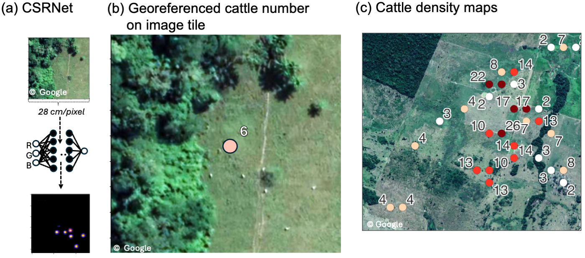

# Tackling deforestation with deep-learning-based cattle counts on satellite images


This repository contains the R code for performing regression analysis on cattle stocking rates  (number of cattle/ hectare) in the Amazon as described in Hodel et al. (in review). We also provide the raw cattle density maps from the deep learning Model (S3_cattle_maps.geojson) and the regression variables. 




## Installation
```bash
   git clone https://github.com/leoniehodel/deepCattleCount_analysis.git
   cd deepCattleCount_analysis
```
Open R or RStudio in the project directory and install packages (depenendcies only for the regression analysis):

``` R
install.packages(c("tidyverse", "texreg", "vtable"))
``` 

## Regression results

To obtain the regression results from the regression_vars.csv file, execute the following command

```R
source("code/03_reg_analysis.R")
```
The regression results will be saved in the results folder.


To generate the plots showing the regression coefficients, run:

```R
source("figures/coef_plot.R")
```

For a comprehensive process that includes preprocessing, regression analysis, and figure generation, run:

```bash
R code/build.R
```
Please note that this step requires downloading several secondary datasets (e.g, Mapbiomas) and install other packages. Download instructions are specified in the corresponding R files. 


# Deep learning model 
For insights into the deep learning part of this research visit: 

[leoniehodel/deepCattleCount](https://github.com/leoniehodel/deepCattleCounts)

